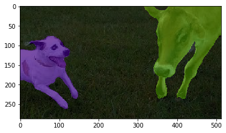

## <a id=using-image-mms-pattern></a> Using the MMS Example for ML model updates with Deployment Policy

Make sure you have completed the [precondition](https://github.com/jiportilla/img-MMS/blob/master/docs/preconditions.md) steps before starting this section. Particularly verifying that service and deployment policies have been configured and are compatible with this node policy.

- Below is the `horizon/node_policy.json` file you reviewed earlier:

```json
{
  "properties": [
    {
      "name": "sensor",
      "value": "camera"
    },
    {
      "name": "location",
      "value": "classroom"
    }
  ],
  "constraints": []
}
```
- It provides values for two `properties` (`sensor` and 'location'), that will affect which services get deployed to this edge node, and states no `constraints`.

If needed, run the following commands to set the environment variables needed by the `object.json` file in your shell:

```bash
cd ~/img-MMS/
export ARCH=$(hzn architecture)
eval $(hzn util configconv -f horizon/hzn.json)
```

1. Register your edge device with this node policy:

```bash
hzn register --policy horizon/node_policy.json
```

2. When the registration completes, use the following command to review the Node Policy:

```bash
hzn policy list
```

- Notice that in addition to the two `properties` stated in the `node_policy.json` file, Horizon has added a few more: `openhorizon.cpu`, `openhorizon.arch`, and `openhorizon.memory`. Horizon provides this additional information automatically and these `properties` may be used in any of your Policy `constraints`.

4. The edge device will make an agreement with one of the IEAM agreement bots (this typically takes about 15 seconds). Repeatedly query the agreements of this device until the `agreement_finalized_time` and `agreement_execution_start_time` fields are filled in:

```bash
hzn agreement list
```

5. After the agreement is made, list the edge service docker container that has been started as a result:

```bash
sudo docker ps
```


6. See the `image.segmenter-mms` service output:

  on **Linux**:

  ```bash
  sudo tail -f /var/log/syslog | grep DEBUG
  ```

7. Open Chrome and navigate to `HTTP://HOSTNAME:5000` where `HOSTNAME`=Node Host Name or IP address


8. Open the python demo notebook at:

http://localhost:8888/notebooks/Downloads/MAX-Image-Segmenter-master/demo.ipynb

9. After a few seconds, follow the instructions on the notebook, you will see results like:




10. Notice the difference in the model results between the two example pictures, you will observe less precision in pictures with multiple objects. Let's see how to update the ML model running on the edge node using the MMS.


11. Before publishing the new ML model,  review the `metadata` file provided to update ML models using MMS publish capabilities


- Below is the `mms/object.json` file provided in this example:

```json
{
  "objectID": "index.js",
  "objectType": "pb",
  "destinationOrgID": "$HZN_ORG_ID",
  "destinationPolicy": {
    "properties": [],
    "constraints": [
        "location == classroom"
     ],
    "services": [
       {
	 "orgID" : "$HZN_ORG_ID",
         "arch": "$ARCH",
         "serviceName" : "$SERVICE_NAME",
         "version": "$SERVICE_VERSION"
       }
    ]
  }, 
  "expiration": "",
  "version": "1.0.0",
  "description": "image demo with tensorflow models",
  "activationTime": ""
}
```

12. Publish the `mms/frozen_inference_graph_mms.pb` file as a new MMS object to update the existing ML model with:
```bash
hzn mms object publish -m mms/object.json -f mms/frozen_inference_graph_mms.pb
```

13. View the published MMS object:
```bash
hzn mms object list -t pb -i frozen_inference_graph_mms.pb -d
```

A few seconds after the `status` field changes to `delivered` you will see changes in the image detected:


Optional:

15. Delete the published mms object with:
```bash
hzn mms object delete -t pb --id frozen_inference_graph_mms.pb
```

16. Unregister your edge node, which will also stop the `image.segmenter-mms` service:

```bash
hzn unregister
```

17. Remove the business policy:

```bash
hzn exchange business removepolicy image.segmenter-mms.bp
```

18. Remove the service policy:

```bash
hzn exchange service removepolicy image.segmenter-mms_1.0.0_amd64
```
See more details at:
[More MMS Details](mms-details.md)

See more examples at: 
[Horizon Examples](https://github.com/open-horizon/examples/)

